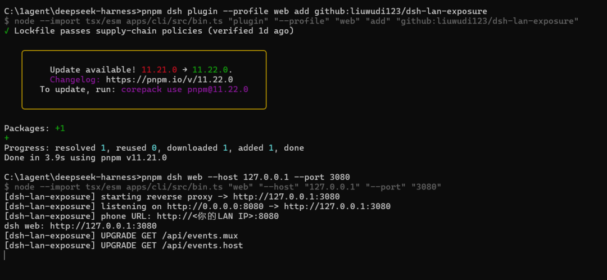
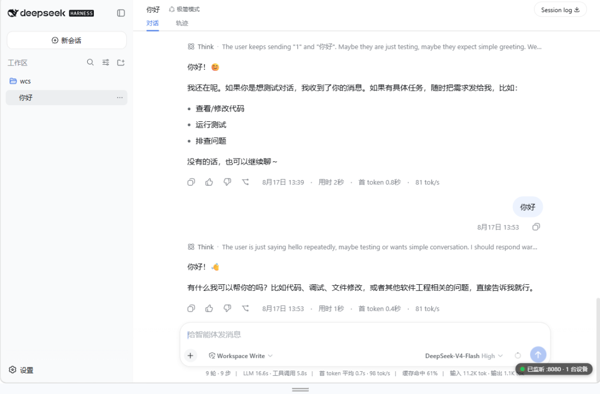

# dsh-lan-exposure

[简体中文 →](README.md) | **English**

Expose dsh's Web GUI to your local network so phones, tablets, and other devices on the same WiFi can access it directly — with real-time sync to your desktop.

For security reasons, dsh's web server only listens on `127.0.0.1` (loopback; it refuses `0.0.0.0`). This plugin starts an **in-process reverse proxy** that listens on `0.0.0.0:8080` and forwards requests to dsh's loopback port `127.0.0.1:3080`, making the GUI reachable from your LAN.

## Features

- **In-process reverse proxy** — starts and stops with dsh; no extra service to deploy
- **Real-time sync** — full WebSocket / SSE upgrade support, so chat and live status stream smoothly on your phone too
- **Live connection badge** — a status pill injected at the bottom-right of the page; green dot = listening, plus the current device count (deduplicated by IP)
- **Built-in status endpoint** — `GET /api/dsh-lan-exposure/status` returns the listening port, target address, and current connection list
- **Phone-browser compatible** — auto-injects a `crypto.randomUUID` polyfill for non-secure contexts (`http://<LAN-IP>`), where some mobile browsers would otherwise throw
- **Optional Basic Auth** — enable via environment variables to keep out unwanted devices on the same subnet
- **Zero dependencies** — uses only Node.js built-in modules, so there is nothing to resolve from `node_modules`

## How It Works

```
Phone / Tablet                 Computer (running dsh)
──────────────                 ──────────────────────
http://<LAN IP>:8080  →        Plugin reverse proxy (0.0.0.0:8080)
                               ↓ rewrites Host / Origin headers
                               dsh web server (127.0.0.1:3080)
```

The proxy rewrites the `Host` and `Origin` headers so dsh's trust fence lets LAN devices through. It also intercepts HTML responses to inject the connection badge and compatibility patches.

## Installation

Run this from the root of your dsh repository:

```bash
pnpm dsh plugin --profile web add github:liuwudi123/dsh-lan-exposure
```

## Start

```bash
pnpm dsh web --host 127.0.0.1 --port 3080
```

The plugin is active when you see:

```
[dsh-lan-exposure] listening on http://0.0.0.0:8080 -> http://127.0.0.1:3080
[dsh-lan-exposure] phone URL: http://<your LAN IP>:8080
```

## Access from Your Phone

1. On your computer, open a terminal and run `ipconfig`. Find the **IPv4 address** of your **WLAN** adapter (e.g. `10.170.9.172`).
2. Connect your phone to the **same WiFi** and open `http://<COMPUTER_IP>:8080` in a browser (e.g. `http://10.170.9.172:8080`).
3. Open the **same session** in the sidebar on both devices — everything stays in sync in real time.

## Screenshots



Accessing dsh from your phone via `http://<COMPUTER_IP>:8080` — the live connection info is shown at the bottom-right corner (green dot = listening, with the current device count):



## Configuration (Optional)

All options are read from environment variables once at load time:

| Environment variable | Default | Description |
|---|---|---|
| `DSH_LAN_ENABLED` | `true` | Enable the plugin (set to `false` to disable) |
| `DSH_LAN_PORT` | `8080` | Public listening port (the port your phone uses) |
| `DSH_LAN_LISTEN_HOST` | `0.0.0.0` | Address the proxy binds to |
| `DSH_LAN_TARGET_HOST` | `127.0.0.1` | dsh's loopback listen address |
| `DSH_LAN_TARGET_PORT` | `3080` | dsh's loopback port (must match `dsh web --port`) |
| `DSH_LAN_AUTH_USER` | unset | Username when Basic Auth is enabled |
| `DSH_LAN_AUTH_PASS` | unset | Password when Basic Auth is enabled |

> Basic Auth only takes effect when **both** `DSH_LAN_AUTH_USER` and `DSH_LAN_AUTH_PASS` are set.

### Example: Use port 18080 instead

**Bash / Linux / macOS:**

```bash
DSH_LAN_PORT=18080 pnpm dsh web --host 127.0.0.1 --port 3080
```

**PowerShell / Windows:**

```powershell
$env:DSH_LAN_PORT = "18080"; pnpm dsh web --host 127.0.0.1 --port 3080
```

### Example: Enable Basic Auth

**Bash:**

```bash
DSH_LAN_AUTH_USER=admin DSH_LAN_AUTH_PASS=secret pnpm dsh web --host 127.0.0.1 --port 3080
```

**PowerShell:**

```powershell
$env:DSH_LAN_AUTH_USER = "admin"; $env:DSH_LAN_AUTH_PASS = "secret"; pnpm dsh web --host 127.0.0.1 --port 3080
```

Once enabled, your phone will be prompted for a username and password.

## Update

Re-run the install command to pull the latest version:

```bash
pnpm dsh plugin --profile web add github:liuwudi123/dsh-lan-exposure
```

## Uninstall

```bash
pnpm dsh plugin --profile web remove @dsh-lan-exposure/lan
```

## FAQ

- **The page won't open on my phone**: Make sure the phone and computer are on the same WiFi; check that your firewall allows the port; DHCP may change the IP, so re-run `ipconfig` for the latest address.
- **Port change doesn't take effect**: `DSH_LAN_PORT` / `DSH_LAN_TARGET_PORT` must be changed together with `dsh web --port`, then restart dsh.
- **What's the status dot?**: Green = listening, showing the current device count (deduplicated by IP — one device with two channels counts once); red = not listening or status unavailable.
- **Live messages aren't syncing**: Make sure you're using the WebSocket upgrade path through the proxy — always browse via `http://<LAN IP>:8080`, not `http://127.0.0.1:8080`.
- **Disable the plugin entirely**: Set `DSH_LAN_ENABLED=false` and restart dsh.

## Security Notes

- There is **no authentication by default** — use it only on a **trusted WiFi** network.
- For public internet access, put a **Tailscale / cloudflared** tunnel in front instead of exposing the port directly.
- If untrusted devices share your subnet, enable Basic Auth (`DSH_LAN_AUTH_USER` / `DSH_LAN_AUTH_PASS`).

## License

MIT
